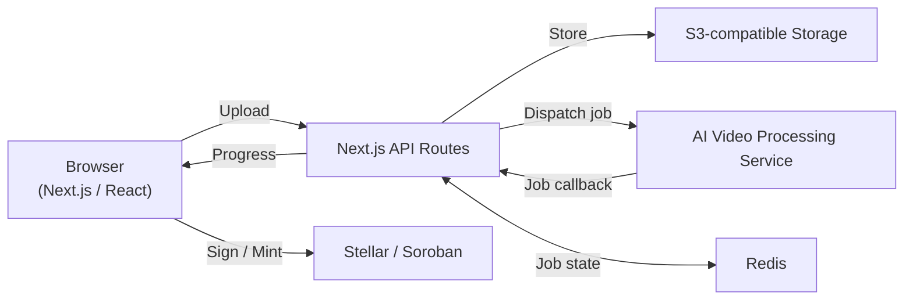

# ClipCash

ClipCash is an AI-powered video clipping platform built to help creators turn long-form videos into short, platform-ready content for TikTok, Instagram Reels, YouTube Shorts, and other social platforms.

Creators can upload or provide a video source, review generated clips, select the moments they want to publish, and explore blockchain-powered ownership through Stellar and Soroban.

## What ClipCash does

- **AI clip generation** — identifies high-retention moments from long-form videos.
- **Clip preview and selection** — creators review clips before publishing.
- **Multi-platform workflow** — designed for TikTok, Instagram Reels, YouTube Shorts, Facebook Reels, Snapchat Spotlight, Pinterest, and LinkedIn.
- **Stellar ownership** — supports Soroban NFT minting for selected clips and on-chain royalties.
- **Embedded wallet** — encrypted wallet storage using browser cryptography.
- **Multi-wallet support** — supports Stellar, EVM, and Solana wallet flows where configured.
- **Social recovery** — uses Shamir's Secret Sharing for supported wallet recovery flows.
- **Earnings dashboard** — provides a unified view of creator revenue data.
- **Real-time processing updates** — uses SSE with polling fallback.
- **Push notifications** — notifies creators when processing is complete.

## Tech stack

| Layer | Technology |
|---|---|
| Framework | Next.js 16 + React 19 + TypeScript |
| Styling | Tailwind CSS 4 |
| State | Zustand 5 |
| Authentication | NextAuth v5 |
| Blockchain | Stellar / Soroban |
| Storage | AWS S3 / Cloudflare R2 / GCS |
| Job state | Redis / in-process storage |
| Testing | Jest + Playwright |
| Components | Storybook |
| Security | Web Crypto API + DOMPurify |

## Architecture



For deeper technical details, see [docs/ARCHITECTURE.md](docs/ARCHITECTURE.md).

For security guidance and the reporting process, see [docs/SECURITY.md](docs/SECURITY.md).

## Getting started

### Prerequisites

- Node.js 18+ (LTS recommended)
- npm
- Git

### Installation

```bash
git clone https://github.com/Johnpii1/clips-frontend.git
cd clips-frontend
npm install
```

Create your local environment file:

```bash
cp .env.example .env.local
```

Add the required values to `.env.local`, then start the development server:

```bash
npm run dev
```

Open `http://localhost:3000` in your browser.

## Environment variables

The complete environment-variable reference is maintained in `.env.example`.

Important production areas include:

- Authentication and OAuth
- AI processing backend
- S3-compatible cloud storage
- Redis
- Stellar / Soroban contracts
- Virus scanning
- Monitoring and analytics
- Transactional email

Never commit `.env.local`, private keys, API secrets, or other credentials.

## Development scripts

| Command | Purpose |
|---|---|
| `npm run dev` | Start the development server |
| `npm run build` | Create a production build |
| `npm run start` | Start the production server |
| `npm run lint` | Run ESLint |
| `npm run typecheck` | Run TypeScript checks |
| `npm run test` | Run unit tests |
| `npm run test:e2e` | Run Playwright end-to-end tests |
| `npm run storybook` | Start Storybook |
| `npm run build-storybook` | Build Storybook |
| `npm run format` | Format the codebase |

## Project structure

```text
app/
├── (dashboard)/          # Authenticated dashboard routes
├── api/                  # API route handlers
├── hooks/                # Application hooks
├── lib/                  # Utilities, auth, security and integrations
├── store/                # Zustand stores
└── onboarding/           # Onboarding flow
components/               # Shared UI and feature components
docs/                     # Architecture and security documentation
tests/e2e/                # Playwright tests
stories/                  # Storybook stories
```

## Security

ClipCash handles authentication, uploaded media, wallet-related data, and third-party integrations. Security-sensitive changes should follow the project guidance in `AGENTS.md` and `docs/SECURITY.md`.

User-controlled content rendered by the application must be sanitized, and `dangerouslySetInnerHTML` should not be used without explicit sanitization.

## Contributions

Contributions are welcome. Please read [CONTRIBUTING.md](CONTRIBUTING.md) before opening a pull request.

This repository retains the existing project history and contributor attribution. Previous contributors remain credited through Git history and GitHub contribution records.

## Project identity

ClipCash is being maintained and developed as an independent project with its own product direction, branding, documentation, and roadmap. Existing contributors and upstream work remain credited rather than being removed or misrepresented.
